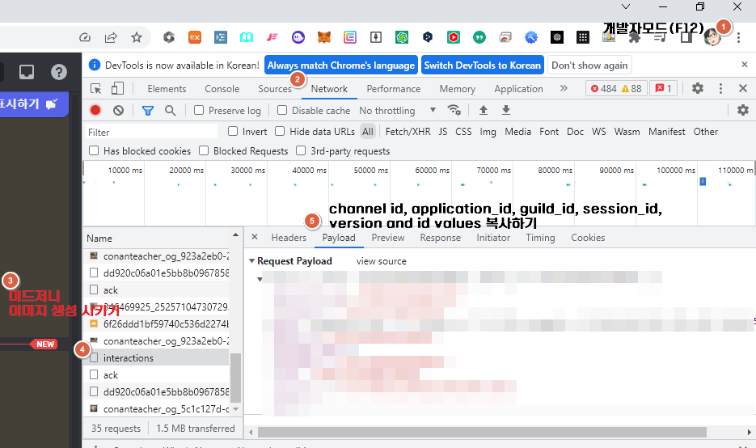

# Maybejourney

Midjourney UI: An elegantly designed, highly customizable interface, purpose-built to enhance the prompt engineering with ChatGPT.


## Features

- Midjourney with highly customizalbe UI
- Describe, upsample and variation images
- User gallery
- ChatGPT prompt helper (Use / in the prompt input)

## Installation

> from https://github.com/George-iam/Midjourney_api#midjourney_api

1.  Create Discord account and create your server(instruction here: https://discord.com/blog/starting-your-first-discord-server)
2.  Create Midjourney account and invite Midjourney Bot to your server (instruction here: https://docs.midjourney.com/docs/invite-the-bot)
3.  Make sure generation works from your server
4. Log in to Discord in Chrome browser, open your server's text channel, click on three points upper right corner, then More Tools and then Developer Tools. Select Network tab, you'll see all the network activity of your page.
5. Now type any prompt to generate in your text channel, and after you press Enter to send message with prompt, you'll see in Network Activity new line named "interaction". Press on it and choose Payload tab and you'll see payload_json - that's what we need! Copy channelid, application_id, guild_id, session_id, version and id values, we'll need it a little bit later. Then move from Payload tab to Headers tab and find "authorization" field, copy it's value too.



---
6. Copy and paste payload and header values to `.streamlit/secrets.toml` file. (Rename `secrets.toml.template` to `secrets.toml`)
7. Get OpenAI API key from [here](https://platform.openai.com/account/api-keys) and copy/paste into `secrets.toml`.
7. Create MySQL or MariaDB for strore prompt and image data. Use the create syntax:

```
CREATE TABLE `prompts` (
  `id` bigint(20) unsigned NOT NULL,
  `user_id` varchar(64) DEFAULT NULL,
  `prompt` text DEFAULT NULL,
  `full_prompt` text DEFAULT NULL,
  `url` varchar(1024) DEFAULT NULL,
  `filename` varchar(256) DEFAULT NULL,
  `is_downloaded` tinyint(4) DEFAULT 0,
  `is_liked` tinyint(4) DEFAULT 0,
  `status` tinyint(4) DEFAULT -1,
  `created_at` timestamp NULL DEFAULT current_timestamp(),
  PRIMARY KEY (`id`)
) ENGINE=InnoDB DEFAULT CHARSET=utf8mb4;
```

8. Run:

```
$ pip install -r requirements.txt
$ streamlit run Imagine.py
```

## Dependency

htbuilder==0.6.1
openai==0.27.6
pandas==1.4.4
python-dotenv==1.0.0
Requests==2.30.0
streamlit==1.22.0
streamlit_extras==0.2.7
streamlit_pills==0.3.0
PyMySQL==1.0.3

## Credits

- Midjourney
- YouTube [빵형의 개발도상국](https://www.youtube.com/@bbanghyong) Brad Lee
- Consultant: 동명대학교 원종윤
- Support
    - [AIFrenz](https://aifrenz.notion.site) - ChatGPT, Midjourney API
    - [The Matrix](https://www.m47rix.com) - Database server

Inquiry : Brad Lee kairess87@gmail.com

## Reference

- https://github.com/George-iam/Midjourney_api
- https://www.reddit.com/r/aipromptprogramming/comments/11xuxoh/prompt_the_ultimate_midjourney_texttoimage_bot
- https://stackoverflow.com/questions/76092002/uploading-files-to-discord-api-thought-put-using-python-requests
